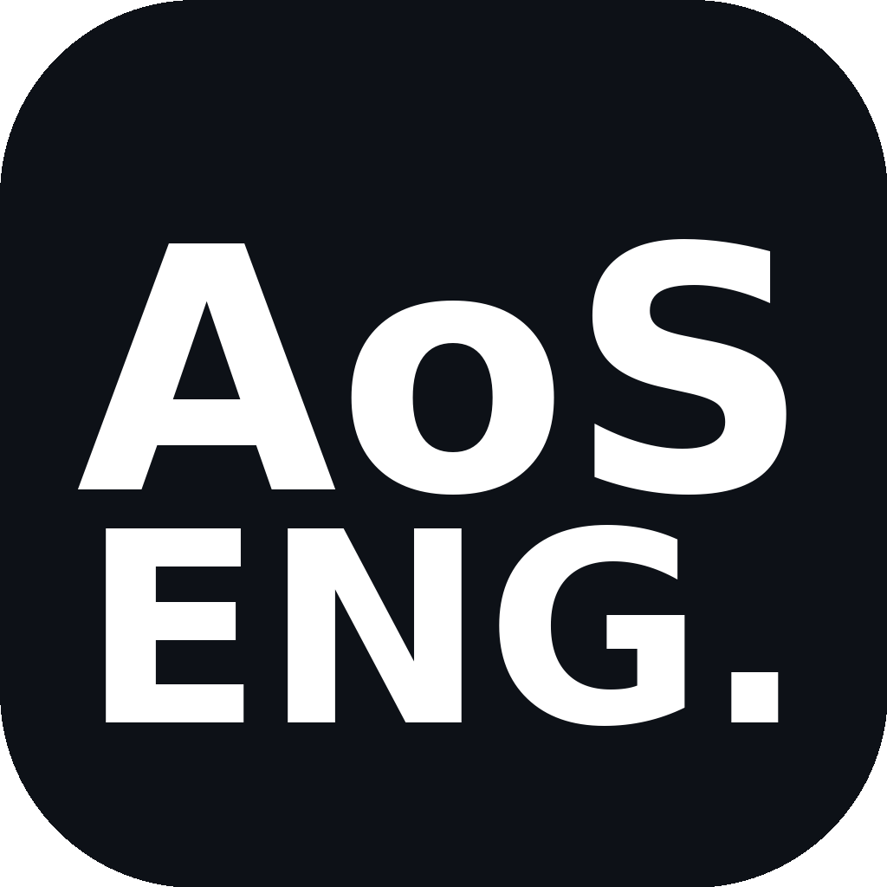

#  Aeros Engine — AoS ENG. v1.21.0 Android + Lite + Full + Vulkan + Linux

Интерактивная визуализация обтекания 3D-модели (STL) потоком воздуха: линии тока, частицы,
распределение давления, подъемная сила, шлирен, объемный дым, скачки уплотнения, вихревые трубки, полет 6DOF, LIC, акустика. C++17 / Vulkan 1.3 / OpenGL 4.6 / GLES 3.0 / CUDA / Dear ImGui / GLM. Android APK для слабых телефонов 1GB RAM Adreno 306, Lite для i3-3xxx / HD 4000 / GT 620M / 4GB RAM / No CUDA.

> v1.21.0 Android: APK <10 MB Potato 300 частиц 3x30 voxel12 15 FPS 800x480 1 поток <150 MB для Adreno 306 Mali-400 1GB RAM Android 5.0+ и Lite <20 MB 800 частиц 6x60 voxel20 25 FPS для 2-4GB RAM, minSdk 21 ES 3.0/2.0 R8 minify 3 ABI NEON touch pinch battery saver; v1.20.1 Lite+: Ultra-Lite Potato 500 частиц 4x40 voxel16 20 FPS 800x450 1 thread, auto-detect weak hardware, battery saver, dynamic quality scaling, launcher, benchmark; v1.20.0 Lite: SSE2 O1 1500 частиц 8x80 voxel24 LBM OFF 32 30 FPS OpenGL 3.3 small binary для i3-3xxx/HD4000/GT620M/4GB RAM; v1.19.0 Vulkan+Linux: Vulkan рендерер с fallback на OpenGL, Linux порт.

## 📥 Скачать (релиз)

Последний релиз: **[GitHub Releases](https://github.com/cumaktimur490-arch/Aeros-Engine/releases)**

### Android — для самых слабых телефонов 1GB RAM Adreno 306 / Mali-400 (NEW v1.21.0!)
| Файл | Описание | Система |
|------|----------|---------|
| `aeros-engine-android-potato-v*.apk` | **Potato APK** <10 MB 300 частиц 3x30 voxel12 15 FPS 800x480 1 поток <150 MB | Android 5.0+ API21+ 1GB RAM Adreno 306 Mali-400 |
| `aeros-engine-android-lite-v*.apk` | **Lite APK** <20 MB 800 частиц 6x60 voxel20 25 FPS 1280x720 2 потока <300 MB | Android 5.0+ 2-4GB RAM Adreno 405+ |

**Быстрый старт Android (слабый телефон):**
1. Скачайте `android-potato` для самых слабых 1GB RAM Adreno 306 Mali-400 или `android-lite` для 2-4GB RAM
2. Скопируйте APK на телефон, откройте файл менеджером — разрешите установку из неизвестных источников
3. Или `adb install aeros-engine-android-lite-v1.21.0.apk`
4. Запустите — touch: один палец drag вращение, два пальца pinch zoom 0.5-2.0
5. Оптимизировано: ES 3.0/2.0 16-bit depth no MSAA no stencil simple shaders, O1 Os NEON R8 minify 3 ABI, 1-2 threads, 15/25 FPS VSync ON battery saver, auto quality scaling

### Windows Lite — для слабых устройств i3-3xxx / HD 4000 / GT 620M / 4GB RAM (NEW v1.20.0!)
| Файл | Описание | Система |
|------|----------|---------|
| `Aeros-Engine-Setup-Lite-x64-v*.exe` | **Lite установщик** SSE2 O1 1500 частиц 30 FPS small binary | Win7+ 64-bit, i3-3xxx, HD 4000, 4GB RAM |
| `Aeros-Engine-Portable-Lite-x64-v*.zip` | **Lite портативная** для слабых ноутов | 64-bit Lite |

**Быстрый старт Windows Lite (слабый ноут):**
1. Скачайте `Setup-Lite-x64` — для i3-3xxx / HD 4000 / GT 620M / 4GB RAM / No CUDA
2. Запустите, включите "Download Lite dependencies (minimal)" — только GLFW, GLM, GLAD, модели, без Vulkan SDK
3. Ярлык: Aeros Engine Lite — окно 1024x600, 30 FPS, low настройки, работает на встроенной графике
4. Оптимизировано: SSE2 only (no AVX2), O1 small binary ~5-10 MB, <512 MB RAM, OpenGL 3.3, MSAA 0, VSync ON, power saving

### Windows Full
| Файл | Описание | Система |
|------|----------|---------|
| `Aeros-Engine-Setup-x64-v*-Vulkan-OpenGL.exe` | Full установщик с авто-загрузкой зависимостей | Windows 10+ 64-bit |
| `Aeros-Engine-Setup-x86-v*.exe` | Full установщик | Windows 10+ 32-bit |
| `Aeros-Engine-Setup-arm64-v*.exe` | Full установщик | Windows 10+ ARM64 |
| `Aeros-Engine-Portable-x64-v*-Vulkan-OpenGL.zip` | Full портативная | 64-bit |
| `Aeros-Engine-Portable-x86-v*.zip` | Full портативная | 32-bit |
| `Aeros-Engine-Portable-arm64-v*.zip` | Full портативная | ARM64 |

**Быстрый старт Windows Full (современный ПК):**
1. Скачайте `Setup-x64-Vulkan-OpenGL` для современного ПК
2. Запустите, включите "Download all required dependencies" — установщик скачает GLFW, GLM, GLAD, ImGui, модели, проверит Vulkan
3. Ярлыки: Aeros Engine (Auto), Vulkan, OpenGL, Download Dependencies
4. Выберите STL модель при запуске

### Linux Lite — для слабых ноутов с Linux (NEW v1.20.0!)
| Файл | Описание |
|------|----------|
| `aeros-engine-lite-linux-x64-v*.tar.gz` | Linux Lite x64 SSE2 O1 30 FPS |
| `aeros-engine-lite` binary | Lite бинарь ~5-10 MB |

**Быстрый старт Linux Lite:**
```bash
cd aeros
./build-lite.sh install-deps  # минимальные: glfw, mesa, X11, openmp — без Vulkan
./build-lite.sh deps          # GLM, GLAD
./build-lite.sh all           # сборка Lite SSE2 O1
./bin/aeros-engine-lite --lite --help
./bin/aeros-engine-lite model.stl
```

### Linux Full
| Файл | Описание |
|------|----------|
| `aeros-engine-linux-x64-v*.tar.gz` | Linux Full x64 Vulkan+OpenGL |
| `aeros-engine-linux` binary | Full бинарь |

**Быстрый старт Linux:**
```bash
# Авто-установщик с зависимостями
./installer/install-linux.sh --deps --all
# или для пользователя
./installer/install-linux.sh --user --deps

# Запуск
aeros-engine --help
aeros-engine --vulkan   # force Vulkan
aeros-engine --opengl   # force OpenGL
aeros-engine model.stl  # загрузить модель

# Ручная сборка
cd aeros
./build-linux.sh install-deps   # системные зависимости
./build-linux.sh download-deps  # GLM, GLAD, ImGui
./build-linux.sh all            # сборка
./bin/aeros-engine

# Makefile
make -f Makefile.linux install-deps
make -f Makefile.linux all
./bin/aeros-engine

# Docker
docker build -f packaging/Dockerfile -t aeros-engine .
docker run -it --rm -e DISPLAY=$DISPLAY -v /tmp/.X11-unix:/tmp/.X11-unix aeros-engine
```

## 🎮 Рендереры (NEW v1.19.0)

- **Vulkan 1.3** — новый, быстрый, низкий CPU overhead, лучше multi-threading, ray tracing ready, работает на Windows и Linux
- **OpenGL 4.6** — проверенный, работает везде
- **Auto** — выбирает Vulkan если доступен, иначе OpenGL (оба полностью рабочие)
- Проверка: `isVulkanAvailable()` динамически грузит `vulkan-1.dll` / `libvulkan.so.1`
- CLI: `--vulkan`, `--opengl`, `--help`
- Настройки: `aeros_settings.ini` `renderer=auto|vulkan|opengl`
- UI: секция "Renderer — Vulkan + OpenGL" — текущий, доступность, устройства, переключение

## 📦 Авто-загрузка зависимостей при установке (NEW v1.19.0)

**Windows:**
- `installer/download_deps.ps1` — скачивает GLFW (3.3.8 prebuilt), GLM (git), GLAD (glad.h, glad.c, khrplatform.h), ImGui (git), проверяет Vulkan SDK (`VULKAN_SDK` env), создает sample cube STL, default config
- Запускается автоматически в установщике (Task: install_deps) + кнопка "Download Dependencies" в меню Пуск
- Ручной: `powershell -File installer/download_deps.ps1 -Arch x64` или `build.bat deps`
- `build.bat` теперь с `:download_deps` — авто-вызов в начале, Vulkan detection, копирует `vulkan-1.dll`

**Linux:**
- `installer/download_deps_linux.sh` — GLM, GLAD, GLFW headers, ImGui, Vulkan check (`pkg-config vulkan`), sample STL, config, desktop file
- `installer/install-linux.sh --deps` — системные (apt/dnf/pacman/zypper) + bundled
- `aeros/build-linux.sh install-deps|download-deps`

Все необходимые файлы (DLL, модели STL, конфиги) — автоматически при установке!

## 🌟 Возможности

### Аэродинамика (v1.17.0 Physics Fix)
- ISA 7 слоев 0-80км с pBase continuity, Sutherland mu(T), плотность/давление/температура/a
- Re=rho*V*L/mu, Mach M=V/a, Cp=(p-p_inf)/q, Bernoulli 1-(V/Vinf)², Prandtl-Glauert beta=sqrt(1-M²)
- Drag polar Cd=Cd0+Cd_i+Cd_wave+Cd_base, Cf Blasius 0.664/sqrt(Re_x) + Schlichting 0.455/log10(Re)^2.58, Cd_i=Cl²/(πAR e), AR=span²/ref, base drag flowDotN>0.7, ground effect Venturi 1.6x mass cons, wake sqrt(D/x) Gaussian b∝sqrt(x), St(Re) Karman, Stratford separation, LBM tau из Re, Smagorinsky (Cs*dx)²|S| van Driest, Stokes

### Интересные визуализации (v1.18.0)
- **Шлирен |∇ρ| и Shadowgraph ∇²ρ** — как в реальной сверхзвуковой трубе, нож Фуко
- **Объемный дым** — 48x32x32 сетка + 20k частиц, ray marching T=exp(-∫σρds), buoyancy, turbulence
- **Скачки уплотнения** — θ-β-M tanθ=2cotβ(M²sin²β-1)/(M²(γ+cos2β)+2), Mach angle μ=arcsin(1/M), Prandtl-Meyer ν(M)
- **Вихревые трубки** — Q>5, |ω|>√10, кластеризация, трассировка вдоль ω, helicity H=v·ω coloring
- **Полет 6DOF** — F=ma, M=Iα, lift+drag+thrust+gravity, ground reaction, auto-trim, Takeoff!
- **LIC** — Line Integral Convolution 256², skin friction lines
- **Акустика** — Lighthill T_ij=ρ v_i v_j, 1/r², 100 источников
- **Температура** — T0/T=1+(γ-1)/2 M², нагрев от скачка и трения
- **Streaklines** — история окрашенного дыма
- 17 режимов визуализации, 8 пресетов

### Рендер и оптимизации
- **Vulkan 1.3 + OpenGL 4.6** — auto-select, оба рабочие, CLI --vulkan/--opengl
- **FSR 1.0** — EASU 12-tap + RCAS sharpening, dynamic resolution, 33-77% scale
- **Frame Generation** — motion vectors из depth+camera+аэродинамика, motion-compensated interpolation, 2x/3x/4x, FSR+FG combo
- Frustum culling, Early-Z, LOD, VRS, async compute

### Базовые
- STL загрузка (бинарный/ASCII), вокселизация SDF 26-neighbor Euclidean Fast Sweeping, частицы 15k-200k, линии тока RK45 adaptive, Cp, lift/drag/moment/CoP, ground effect, slice plane, ISA атмосфера, единицы скорости м/с км/ч mph kts ft/s, x64/x86/arm64, Linux/Windows

## Сборка

### Windows
Требуется: Visual Studio 2022, CUDA Toolkit опционально, Vulkan SDK опционально (для Vulkan рендерера, иначе OpenGL fallback)
```bat
cd aeros
build.bat deps          # скачать зависимости (GLFW, GLM, GLAD, ImGui)
build.bat               # x64 Vulkan+OpenGL auto
build.bat x64           # x64
build.bat x86           # x86
build.bat vulkan        # Vulkan only
build.bat opengl        # OpenGL only
build.bat clean         # очистка
```

### Linux
```bash
cd aeros
./build-linux.sh install-deps   # системные зависимости (apt/dnf/pacman)
./build-linux.sh download-deps  # bundled (GLM, GLAD, ImGui)
./build-linux.sh check-deps     # проверка
./build-linux.sh all            # auto Vulkan+OpenGL
./build-linux.sh vulkan         # Vulkan only
./build-linux.sh opengl         # OpenGL only
./bin/aeros-engine --help

# Makefile
make -f Makefile.linux install-deps
make -f Makefile.linux all
make -f Makefile.linux package
```

### CMake (Windows и Linux)
```bash
cmake -B build -DAEROS_ENABLE_VULKAN=ON -DAEROS_DOWNLOAD_DEPS=ON
cmake --build build --config Release
# Linux
cmake -B build && cmake --build build
./build/aeros-engine --help
```

### Docker
```bash
docker build -f packaging/Dockerfile -t aeros-engine .
docker run -it --rm -e DISPLAY=$DISPLAY -v /tmp/.X11-unix:/tmp/.X11-unix aeros-engine
```

## Linux Port Details

- **File dialog**: zenity (`zenity --file-selection`) или kdialog или fallback к `./models/`, `/usr/share/aeros-engine/`, консольный ввод
- **Зависимости**: `libglfw3-dev libgl1-mesa-dev libx11-dev libxrandr-dev libxinerama-dev libxcursor-dev libxi-dev libvulkan-dev vulkan-tools glslc zenity kdialog libopenmp-dev`
- **Установка**: `installer/install-linux.sh --deps --all` — ставит в `/usr/local/bin/aeros-engine`, модели в `/usr/local/share/aeros-engine/models/`, desktop в `/usr/local/share/applications/aeros-engine.desktop`, иконку в `/usr/local/share/icons/...`
- **User install**: `installer/install-linux.sh --user --deps` — в `~/.local/bin/`
- **Uninstall**: `installer/uninstall-linux.sh --prefix /usr/local` или `--user`
- **Vulkan**: `sudo apt install libvulkan-dev vulkan-tools`, проверка `vulkaninfo --summary`, `pkg-config --modversion vulkan`
- **OpenGL**: всегда работает, даже без Vulkan

## Релизы (PC)

PC-релизы публикуются в Releases по тегу `vX.Y.Z` и собираются GitHub Actions
(`.github/workflows/pc-release.yml`) в формате прежних PC-версий:
установщики `Aeros-Engine-Setup-<arch>-vX.Y.Z.exe`, апдейтеры
`Aeros-Engine-Update-<arch>-vX.Y.Z.exe` и портативные
`Aeros-Engine-Portable-<arch>-vX.Y.Z.zip` для x64 / x86 / arm64,
плюс `SHA256SUMS.txt`. x64 — с CUDA (fallback CPU), x86/arm64 — CPU-сборки.

Локально: `aeros\build.bat [x64|x86]` (CUDA), `aeros\build-cpu.bat [x64|x86|arm64]` (CPU),
установщики — `installer\build-installers.ps1`, портативные — `installer\build-portable.ps1`
(Inno Setup 6; GLFW для x86/arm64 подтянут `tools\get-glfw-x86.ps1` / `tools\build-glfw-arm64.ps1`).

## Лицензия


GoGonam AoS. 2026 — MIT (см. LICENSE)

## Ссылки

- GitHub: https://github.com/cumaktimur490-arch/Aeros-Engine
- Releases: https://github.com/cumaktimur490-arch/Aeros-Engine/releases
- Vulkan SDK: https://vulkan.lunarg.com/
- GLFW: https://www.glfw.org/
